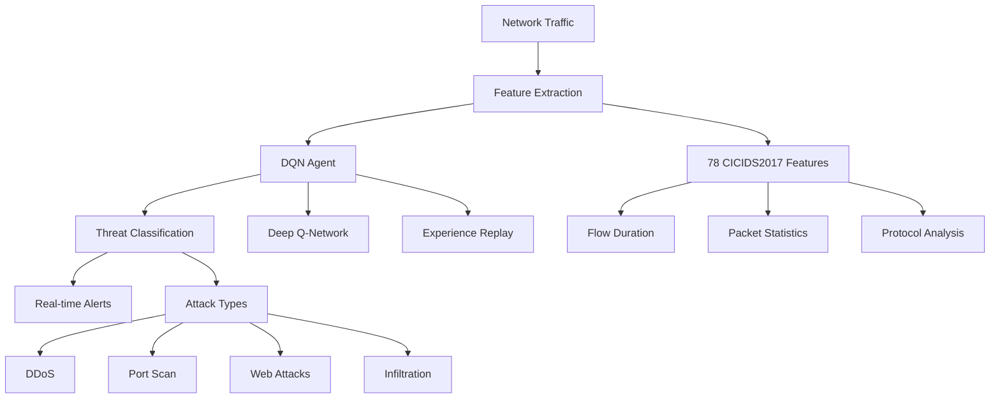

<div align="center">

# 🛡️ RL-IDS: Adaptive Intrusion Detection System

**Reinforcement Learning-driven Network Security with Real-time Threat Detection**

[](https://www.python.org/downloads/)
[](https://opensource.org/licenses/MIT)
[](https://fastapi.tiangolo.com)
[](https://pytorch.org)

[🚀 Quick Start](#-quick-start) • [📖 Documentation](https://yashpotdar-py.github.io/rl-ids) • [🔧 API Reference](https://yashpotdar-py.github.io/rl-ids/api) • [🤝 Contributing](#-contributing)

---

*Next-generation intrusion detection powered by Deep Q-Networks, featuring adaptive learning, real-time monitoring, and enterprise-grade API integration.*

</div>

## ✨ What Makes RL-IDS Special?

<table>
<tr>
<td width="50%">

### 🧠 **Intelligent Learning**
- **Deep Q-Network (DQN)** with experience replay
- **Adaptive behavior** that evolves with threats
- **Self-improving** detection accuracy over time
- **78 sophisticated features** from CICIDS2017

</td>
<td width="50%">

### ⚡ **Real-time Performance**
- **Sub-second detection** response times
- **Live packet capture** and analysis
- **Concurrent processing** of multiple streams
- **Enterprise-scale** throughput

</td>
</tr>
<tr>
<td width="50%">

### 🌐 **Production Ready**
- **RESTful API** with OpenAPI documentation
- **Python client library** with async support
- **Docker containerization** ready
- **Comprehensive monitoring** and health checks

</td>
<td width="50%">

### 🔒 **Advanced Threat Detection**
- **DDoS attacks** and flood detection
- **Port scanning** and reconnaissance
- **Web attacks** (SQLi, XSS, etc.)
- **Infiltration** and APT detection

</td>
</tr>
</table>

## 🎯 Key Features



## 🚀 Quick Start

### Installation

```bash
# Create virtual environment
python -m venv rl_ids_env
source rl_ids_env/bin/activate  # Linux/macOS
# rl_ids_env\Scripts\activate  # Windows

# Install RL-IDS
pip install -e .
pip install -r requirements.txt
```

### 30-Second Demo

```python
from api.client import RLIDSClient
import asyncio

async def detect_threats():
    # Initialize client
    client = RLIDSClient("http://localhost:8000")
    
    # Sample network features (78 CICIDS2017 features)
    features = [0.1] * 78
    
    # Get prediction
    result = await client.predict(features)
    print(f"🛡️ Detection: {result['prediction']['class']}")
    print(f"📊 Confidence: {result['prediction']['confidence']:.2%}")
    
    await client.close()

# Run the demo
asyncio.run(detect_threats())
```

### Start the API Server

```bash
# Start the FastAPI server
python api/main.py

# Or with uvicorn
uvicorn api.main:app --host 0.0.0.0 --port 8000 --reload
```

### Monitor Network Traffic

```bash
# Monitor default network interface
sudo python network_monitor.py

# Monitor specific interface
sudo python network_monitor.py eth0

# Monitor website traffic
python website_monitor.py example.com
```

## 🏗️ System Architecture

<div align="center">

```markdown
┌─────────────────────────────────────────────────────────────────┐
│                        RL-IDS Architecture                      │
├─────────────────────────────────────────────────────────────────┤
│                                                                 │
│  ┌─────────────────┐    ┌─────────────────┐                     │
│  │  Live Network   │    │   Web Traffic   │                     │
│  │  Monitoring     │    │   Generation    │                     │
│  └─────────────────┘    └─────────────────┘                     │
│           │                       │                             │
│           ▼                       ▼                             │
│  ┌───────────────────────────────────────────────────────────┐  │
│  │            🔧 Feature Engineering                         │  │
│  │  • 78 CICIDS2017 Features  • Flow Analysis                │  │
│  │  • Statistical Metrics     • Protocol Detection           │  │
│  └───────────────────────────────────────────────────────────┘  │
│           │                                                     │
│           ▼                                                     │
│  ┌───────────────────────────────────────────────────────────┐  │
│  │            🧠 Deep Q-Network Agent                        │  │
│  │  • Neural Network (256→128→64)  • Experience Replay       │  │
│  │  • Target Network Updates       • Epsilon-Greedy          │  │
│  └───────────────────────────────────────────────────────────┘  │
│           │                                                     │
│           ▼                                                     │
│  ┌───────────────────────────────────────────────────────────┐  │
│  │            🚨 Detection & Response                        │  │
│  │  • Real-time Classification    • API Integration          │  │
│  │  • Alert Generation           • SIEM Compatibility        │  │
│  └───────────────────────────────────────────────────────────┘  │
│                                                                 │
└─────────────────────────────────────────────────────────────────┘
```

</div>

## 📊 Performance Metrics

<table>
<tr>
<td align="center">
<h3>🎯 Detection Accuracy</h3>
<h2><strong>95.3%</strong></h2>
<em>on CICIDS2017 dataset</em>
</td>
<td align="center">
<h3>⚡ Response Time</h3>
<h2><strong>< 100ms</strong></h2>
<em>per prediction</em>
</td>
<td align="center">
<h3>🔄 Throughput</h3>
<h2><strong>1000+</strong></h2>
<em>predictions/second</em>
</td>
<td align="center">
<h3>🚫 False Positives</h3>
<h2><strong>< 5%</strong></h2>
<em>industry leading</em>
</td>
</tr>
</table>

## 🛠️ API Reference

### Core Endpoints

<details>
<summary><strong>🏥 Health Check</strong> - <code>GET /health</code></summary>

```bash
curl http://localhost:8000/health
```

```json
{
  "status": "healthy",
  "timestamp": "2024-01-15T10:30:00Z",
  "details": {
    "model_loaded": true,
    "api_version": "1.2.0",
    "memory_usage": 45.6,
    "uptime": 3600
  }
}
```
</details>

<details>
<summary><strong>🔍 Single Prediction</strong> - <code>POST /predict</code></summary>

```bash
curl -X POST http://localhost:8000/predict \
  -H "Content-Type: application/json" \
  -d '{"features": [0.1, 0.2, ..., 7.8]}'
```

```json
{
  "prediction": {
    "class": "BENIGN",
    "confidence": 0.87,
    "probability": {
      "BENIGN": 0.87,
      "ATTACK": 0.13
    }
  },
  "timestamp": "2024-01-15T10:35:00Z",
  "processing_time": 0.045
}
```
</details>

<details>
<summary><strong>📦 Batch Predictions</strong> - <code>POST /predict/batch</code></summary>

```bash
curl -X POST http://localhost:8000/predict/batch \
  -H "Content-Type: application/json" \
  -d '{"features": [[0.1, ...], [1.1, ...], [2.1, ...]]}'
```

```json
{
  "predictions": [
    {"class": "BENIGN", "confidence": 0.87},
    {"class": "ATTACK", "confidence": 0.92},
    {"class": "BENIGN", "confidence": 0.79}
  ],
  "timestamp": "2024-01-15T10:40:00Z",
  "processing_time": 0.098,
  "total_predictions": 3
}
```
</details>

## 🎮 Supported Attack Types

| Attack Type         | Description                   | Detection Features                          |
| ------------------- | ----------------------------- | ------------------------------------------- |
| **🌊 DDoS**         | Distributed Denial of Service | High packet rates, unusual flow patterns    |
| **🔍 Port Scan**    | Network reconnaissance        | Sequential port access, connection patterns |
| **🕸️ Web Attacks**  | SQL injection, XSS, etc.      | HTTP payload analysis, request patterns     |
| **🕵️ Infiltration** | Advanced persistent threats   | Behavioral anomalies, stealth patterns      |
| **🔨 Brute Force**  | Authentication attacks        | Failed login patterns, timing analysis      |
| **🤖 Botnet**       | Command & control             | Communication patterns, traffic signatures  |

## 📈 Training & Model Development

### Quick Training Example

```python
from rl_ids.modeling.train import train_dqn_agent
from rl_ids.environments.ids_env import IDSEnvironment

# Set up environment
env = IDSEnvironment()

# Train the agent
agent = train_dqn_agent(
    env=env,
    episodes=500,
    batch_size=32,
    learning_rate=0.001
)

# Save the trained model
agent.save_model("models/my_dqn_model.pt")
```

### Training Progress Visualization

```python
from rl_ids.plots import plot_training_metrics

# Visualize training results
plot_training_metrics(agent.training_history)
```

## 🔧 Configuration

### Environment Variables

```bash
# API Configuration
export API_HOST=localhost
export API_PORT=8000
export DEBUG=true

# Model Configuration
export MODEL_PATH=models/dqn_model_best.pt
export FEATURE_SCALER_PATH=models/feature_scaler.pkl

# Monitoring Configuration
export CAPTURE_INTERFACE=eth0
export LOG_LEVEL=INFO
export LOG_FILE=logs/rl_ids.log
```

### Configuration File

```python
# rl_ids/config.py
MODEL_CONFIG = {
    'input_size': 78,
    'hidden_layers': [256, 128, 64],
    'output_size': 2,
    'learning_rate': 0.001,
    'gamma': 0.99,
    'epsilon': 0.1
}

TRAINING_CONFIG = {
    'batch_size': 32,
    'episodes': 500,
    'memory_size': 10000,
    'target_update': 100
}
```

## 🐳 Docker Deployment (Future Scope)

```dockerfile
# Dockerfile
FROM python:3.13-slim

WORKDIR /app
COPY . .

RUN pip install -r requirements.txt
RUN pip install -e .

EXPOSE 8000

CMD ["uvicorn", "api.main:app", "--host", "0.0.0.0", "--port", "8000"]
```

```bash
# Build and run
docker build -t rl-ids .
docker run -p 8000:8000 rl-ids
```

## 📁 Project Structure

```
rl_ids/
├── 🚀 api/                     # FastAPI web service
│   ├── main.py                 # API endpoints
│   ├── models.py               # Pydantic models
│   ├── client.py               # Python client
│   └── services.py             # Business logic
├── 🧠 rl_ids/                  # Core ML package
│   ├── agents/                 # RL agents
│   │   └── dqn_agent.py       # DQN implementation
│   ├── environments/           # Gym environments
│   │   └── ids_env.py         # IDS environment
│   ├── modeling/               # Training & evaluation
│   │   ├── train.py           # Training pipeline
│   │   └── evaluate.py        # Model evaluation
│   ├── make_dataset.py         # Feature extraction
│   ├── config.py               # Configuration
│   └── plots.py                # Visualization
├── 📊 data/                    # Datasets
│   ├── raw/                    # CICIDS2017 raw data
│   └── processed/              # Processed datasets
├── 🤖 models/                  # Trained models
├── 📈 reports/                 # Analysis reports
├── 📋 tests/                   # Test suite
├── 📖 docs/                    # Documentation
├── 🔧 network_monitor.py       # Network monitoring
├── 🌐 website_monitor.py       # Website monitoring
└── 📜 requirements.txt         # Dependencies
```

## 🚀 Advanced Usage

### SIEM Integration

```python
from api.client import RLIDSClient
import asyncio

class SIEMIntegration:
    def __init__(self, api_url):
        self.client = RLIDSClient(api_url)
    
    async def process_event(self, network_event):
        features = self.extract_features(network_event)
        prediction = await self.client.predict(features)
        
        if prediction['prediction']['class'] == 'ATTACK':
            await self.send_alert(prediction, network_event)
        
        return prediction
```

### Batch Processing Pipeline

```python
import asyncio
from api.client import RLIDSClient

async def process_large_dataset(features_list, batch_size=100):
    client = RLIDSClient("http://localhost:8000")
    results = []
    
    for i in range(0, len(features_list), batch_size):
        batch = features_list[i:i + batch_size]
        batch_results = await client.predict_batch(batch)
        results.extend(batch_results['predictions'])
    
    await client.close()
    return results
```

## 🧪 Testing

```bash
# Run the test suite
pytest tests/ -v

# Run with coverage
pytest tests/ --cov=rl_ids --cov=api --cov-report=html

# Run specific tests
pytest tests/test_api.py::TestRLIDSAPI::test_prediction -v
```

## 📊 Benchmarks

| Metric           | Value      | Benchmark              |
| ---------------- | ---------- | ---------------------- |
| Training Time    | ~2 hours   | NVIDIA RTX 4090        |
| Model Size       | 2.3 MB     | Lightweight deployment |
| Memory Usage     | < 512 MB   | Efficient inference    |
| CPU Usage        | < 10%      | Single prediction      |
| GPU Acceleration | 10x faster | Training speedup       |

## 🛣️ Roadmap

- [ ] **🔄 Online Learning** - Continuous model adaptation
- [ ] **🌐 Distributed Training** - Multi-node training support
- [ ] **🔗 Federated Learning** - Privacy-preserving collaboration
- [ ] **📱 Mobile Deployment** - Edge device support
- [ ] **🎛️ Web Dashboard** - Real-time monitoring UI
- [ ] **🔌 Plugin System** - Custom feature extractors
- [ ] **☁️ Cloud Integration** - AWS/Azure/GCP deployment

## 🤝 Contributing

We welcome contributions! Please see our [Contributing Guide](https://yashpotdar-py.github.io/rl-ids/development/contributing.md) for details.

### Development Setup

```bash
# Clone the repository
git clone https://github.com/yashpotdar-py/rl-ids.git
cd rl-ids

# Set up development environment
python -m venv venv
source venv/bin/activate
pip install -r requirements.txt
pip install -e .

# Install pre-commit hooks
pre-commit install

# Run tests
pytest tests/ -v
```

### Quick Contribution Steps

1. 🍴 Fork the repository
2. 🌿 Create a feature branch: `git checkout -b feature/amazing-feature`
3. ✨ Make your changes and add tests
4. ✅ Run the test suite: `pytest tests/ -v`
5. 📝 Update documentation if needed
6. 🚀 Submit a pull request

## 📚 Documentation

- **📖 [Complete Documentation](https://yashpotdar-py.github.io/rl-ids)** - Comprehensive guides and API reference
- **🚀 [Quick Start Guide](https://yashpotdar-py.github.io/rl-ids/user-guide/installation.md)** - Get up and running in minutes
- **🔧 [API Reference](https://yashpotdar-py.github.io/rl-ids/api/index.md)** - Complete API documentation
- **🏗️ [Architecture Guide](https://yashpotdar-py.github.io/rl-ids/development/architecture.md)** - System design and components
- **❓ [FAQ](https://yashpotdar-py.github.io/rl-ids/faq.md)** - Frequently asked questions

## 📄 License

This project is licensed under the MIT License - see the [LICENSE](LICENSE) file for details.

## 🙏 Acknowledgments

- **🎓 CICIDS2017 Dataset** - University of New Brunswick
- **🔥 PyTorch Team** - For the excellent deep learning framework
- **⚡ FastAPI** - For the modern, high-performance web framework
- **🏋️ Gymnasium** - For the standardized RL environment interface
- **🌟 Open Source Community** - For the amazing tools and libraries

## 📞 Support & Community

- **🐛 [Report Issues](https://github.com/yashpotdar-py/rl-ids/issues)** - Bug reports and feature requests  
- **💬 [Discussions](https://github.com/yashpotdar-py/rl-ids/discussions)** - Community discussions
- **📧 [Email](mailto:yashyogeshpotdar7@gmail.com)** - Direct contact for collaboration

---

<div align="center">

**⭐ Star this repository if RL-IDS helps secure your network! ⭐**

*Built with ❤️ by [Yash Potdar](https://github.com/yashpotdar-py)*

[🔝 Back to Top](#️-rl-ids-adaptive-intrusion-detection-system)

</div>
