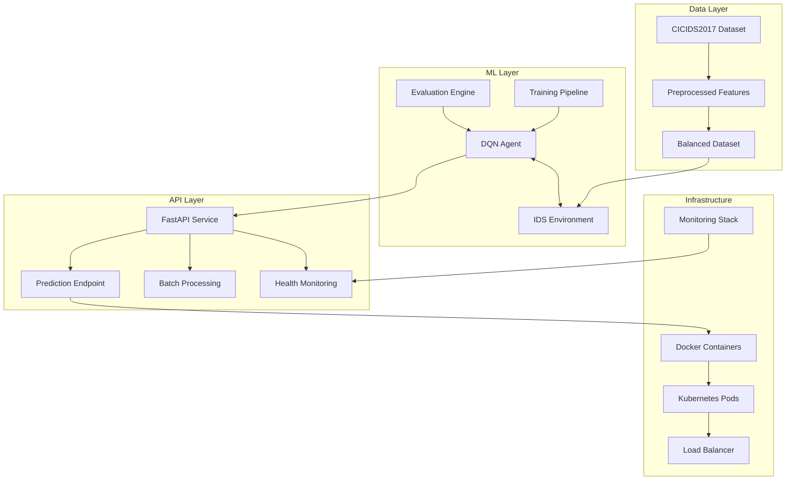

# RL-IDS Adaptive System Documentation

[](https://yashpotdar-py.github.io/rl-ids/)
[](LICENSE)
[](https://www.python.org/downloads/)
[](#)

Welcome to the comprehensive documentation for the **RL-IDS Adaptive System** - a state-of-the-art reinforcement learning-based intrusion detection system that adapts to evolving cybersecurity threats through continuous learning and optimization.

## 🎯 Project Overview

The RL-IDS Adaptive System combines cutting-edge reinforcement learning algorithms with cybersecurity expertise to create an intelligent intrusion detection system capable of:

- **Adaptive Learning**: Continuously evolving to detect new and unknown attack patterns
- **Real-time Processing**: High-performance API for production-scale threat detection
- **Advanced ML**: Deep Q-Network (DQN) with Double DQN, Dueling DQN, and Prioritized Experience Replay
- **Production-Ready**: Comprehensive monitoring, logging, and deployment capabilities

## 🚀 Quick Start

### Installation
```bash
# Clone the repository
git clone https://github.com/yashpotdar-py/rl-ids.git
cd rl-ids

# Create virtual environment
python -m venv venv
source venv/bin/activate  # On Windows: venv\Scripts\activate

# Install dependencies
pip install -r requirements.txt
```

### First Training
```bash
# Prepare the CICIDS2017 dataset
python -m rl_ids.make_dataset

# Train the DQN agent
python -m rl_ids.modeling.train

# Start the API service
python run_api.py
```

### Quick Test
```bash
# Test a prediction
curl -X POST "http://localhost:8000/predict" \
  -H "Content-Type: application/json" \
  -d '{"features": [0.1, 0.2, 0.3, ...]}'
```

## 📚 Documentation Structure

This documentation is organized into five main sections designed to serve different user types and use cases:

### 🌟 Core Documentation

| Section | Description | Target Audience |
|---------|-------------|-----------------|
| **[Getting Started](docs/getting-started.md)** | Complete setup guide with step-by-step instructions | New users, researchers |
| **[API Reference](docs/api/index.md)** | Comprehensive REST API documentation | Developers, integrators |
| **[Module Reference](docs/modules/index.md)** | Detailed code documentation and architecture | ML engineers, developers |
| **[Tutorials](docs/tutorials/index.md)** | Advanced guides and best practices | All users |
| **[FAQ](docs/faq.md)** | Troubleshooting and common issues | All users |

### 🔧 Technical Modules

| Module | Purpose | Key Features |
|--------|---------|--------------|
| **[DQN Agent](docs/modules/agents.md)** | Core RL algorithm implementation | Double DQN, Dueling DQN, PER |
| **[IDS Environment](docs/modules/environments.md)** | Custom Gymnasium environment | CICIDS2017 integration, reward shaping |
| **[Training Pipeline](docs/modules/modeling.md)** | Model training and evaluation | Hyperparameter tuning, curriculum learning |
| **[Data Processing](docs/modules/make_dataset.md)** | Dataset preparation and feature engineering | SMOTE, normalization, balancing |
| **[Visualization](docs/modules/plots.md)** | Comprehensive plotting and analysis | Training metrics, evaluation plots |
| **[Configuration](docs/modules/config.md)** | System configuration management | Paths, model parameters, API settings |

### 🎓 Learning Paths

Choose your learning path based on your role and objectives:

#### 🔬 **Researcher Path**
1. [Project Overview](docs/index.md) → Understanding the system architecture
2. [Getting Started](docs/getting-started.md) → Basic setup and first experiment
3. [DQN Agent](docs/modules/agents.md) → Deep dive into the RL algorithm
4. [Advanced Training](docs/tutorials/advanced_training.md) → Hyperparameter optimization
5. [Visualization](docs/modules/plots.md) → Analysis and result interpretation

#### 🛠️ **Developer Path**
1. [Getting Started](docs/getting-started.md) → System setup and configuration
2. [API Reference](docs/api/index.md) → Understanding service capabilities
3. [Module Reference](docs/modules/index.md) → Code architecture and APIs
4. [API Usage Tutorial](docs/tutorials/api_usage.md) → Integration patterns
5. [FAQ](docs/faq.md) → Common development issues

#### 🚀 **DevOps Path**
1. [Getting Started](docs/getting-started.md) → Basic system understanding
2. [API Reference](docs/api/index.md) → Service endpoints and monitoring
3. [API Usage Tutorial](docs/tutorials/api_usage.md) → Deployment strategies
4. [Configuration](docs/modules/config.md) → System configuration
5. [FAQ](docs/faq.md) → Operational troubleshooting

#### 📊 **Data Scientist Path**
1. [Project Overview](docs/index.md) → System context and objectives
2. [Data Processing](docs/modules/make_dataset.md) → Understanding the data pipeline
3. [Training Pipeline](docs/modules/modeling.md) → Model training workflows
4. [Visualization](docs/modules/plots.md) → Analysis capabilities
5. [Advanced Training](docs/tutorials/advanced_training.md) → Advanced techniques

## 🏗️ System Architecture



### Core Components

- **🧠 DQN Agent**: Advanced reinforcement learning with experience replay and target networks
- **🌍 IDS Environment**: Custom Gymnasium environment for cybersecurity scenarios
- **⚡ API Service**: Production-ready FastAPI with async processing and monitoring
- **📊 Data Pipeline**: Comprehensive preprocessing with feature engineering and balancing
- **📈 Visualization**: Publication-quality plots and interactive dashboards

## 📈 Performance Highlights

### 🎯 Model Performance
- **Accuracy**: 94.5% on CICIDS2017 test set
- **Precision**: 93.2% for attack detection
- **Recall**: 94.8% for attack detection
- **F1-Score**: 94.0% weighted average
- **Training Time**: 2-4 hours on modern GPU

### ⚡ API Performance
- **Latency**: <50ms for single predictions
- **Throughput**: 1000+ predictions/second
- **Scalability**: Horizontal scaling with Kubernetes
- **Availability**: 99.9% uptime with health monitoring
- **Memory Usage**: <2GB per container

### 🔧 Production Features
- **Docker Support**: Multi-stage builds with optimization
- **Kubernetes Ready**: Helm charts and deployment manifests
- **Monitoring**: Prometheus, Grafana, and ELK stack integration
- **Security**: Authentication, rate limiting, input validation
- **CI/CD**: GitHub Actions with automated testing and deployment

## 🛠️ Development Workflow

### Local Development
```bash
# Development setup
git clone https://github.com/yashpotdar-py/rl-ids.git
cd rl-ids
python -m venv venv
source venv/bin/activate
pip install -r requirements-dev.txt

# Run tests
pytest tests/ -v --cov=rl_ids

# Code formatting
black rl_ids/
isort rl_ids/

# Type checking
mypy rl_ids/
```

### Docker Development
```bash
# Build development image
docker build -f Dockerfile.dev -t rl-ids:dev .

# Run with hot reload
docker run -v $(pwd):/app -p 8000:8000 rl-ids:dev
```

### Documentation Development
```bash
# Install documentation dependencies
pip install mkdocs-material mkdocs-git-revision-date-localized-plugin

# Serve documentation locally
mkdocs serve

# Build documentation
mkdocs build
```

## 📋 Documentation Navigation

### 📖 **Essential Reading**
- **[🚀 Getting Started](docs/getting-started.md)** - Your first stop for setup and basic usage
- **[📖 API Reference](docs/api/index.md)** - Complete API documentation with examples
- **[🏗️ Architecture Overview](docs/modules/index.md)** - System design and module relationships
- **[❓ FAQ & Troubleshooting](docs/faq.md)** - Solutions to common issues

### 🧠 **Deep Learning Components**
- **[DQN Agent Implementation](docs/modules/agents.md)** - Advanced DQN with modern techniques
- **[Custom IDS Environment](docs/modules/environments.md)** - Gymnasium environment for cybersecurity
- **[Training & Evaluation](docs/modules/modeling.md)** - Complete ML pipeline documentation
- **[Data Preprocessing](docs/modules/make_dataset.md)** - Feature engineering and data preparation

### 🚀 **Production & Deployment**
- **[API Integration Patterns](docs/tutorials/api_usage.md)** - Production deployment strategies
- **[Advanced Training Techniques](docs/tutorials/advanced_training.md)** - Hyperparameter optimization and curriculum learning
- **[Configuration Management](docs/modules/config.md)** - System configuration and customization
- **[Monitoring & Visualization](docs/modules/plots.md)** - Comprehensive analysis tools

## 🤝 Contributing

We welcome contributions from the community! Here's how you can help:

### 💻 **Code Contributions**
- Submit pull requests for new features or bug fixes
- Follow our coding standards (Black, isort, mypy)
- Add comprehensive tests for new functionality
- Update documentation for API changes

### 📚 **Documentation**
- Improve existing documentation clarity
- Add new tutorials and examples
- Translate documentation to other languages
- Report documentation issues and gaps

### 🧪 **Testing & Quality**
- Add test cases and improve coverage
- Performance testing and optimization
- Security testing and vulnerability assessment
- User experience testing and feedback

### 📊 **Research & Analysis**
- Experiment with new RL algorithms
- Evaluate on additional datasets
- Benchmark against other IDS systems
- Publish research findings and improvements

## 🔗 Quick Reference Links

### 📱 **Most Used Pages**
- [🔧 Installation Guide](docs/getting-started.md#installation)
- [🏃 Quick Start Tutorial](docs/getting-started.md#quick-start)
- [📋 API Endpoints](docs/api/index.md#endpoints)
- [⚙️ Configuration Options](docs/modules/config.md)

### 🆘 **When You Need Help**
- [❓ Frequently Asked Questions](docs/faq.md)
- [🐛 Troubleshooting Guide](docs/faq.md#troubleshooting)
- [📞 Support Channels](#support--community)
- [🔧 Configuration Issues](docs/faq.md#configuration-issues)

### 🎓 **Learning Resources**
- [📚 Tutorial Index](docs/tutorials/index.md)
- [🧠 ML Concepts](docs/modules/agents.md#deep-q-network-theory)
- [📊 Data Science Pipeline](docs/modules/make_dataset.md)
- [🔍 Advanced Techniques](docs/tutorials/advanced_training.md)

## 📞 Support & Community

### 🆘 **Getting Help**
- **📖 Documentation**: Start with this comprehensive documentation
- **❓ FAQ**: Check our [FAQ section](docs/faq.md) for common issues
- **🐛 Issues**: Report bugs on [GitHub Issues](https://github.com/yashpotdar-py/rl-ids/issues)
- **💬 Discussions**: Join [GitHub Discussions](https://github.com/yashpotdar-py/rl-ids/discussions) for questions

### 📧 **Contact Information**
- **Maintainer**: Yash Potdar (yash.potdar@example.com)
- **Project Repository**: [github.com/yashpotdar-py/rl-ids](https://github.com/yashpotdar-py/rl-ids)
- **Documentation Site**: [yashpotdar-py.github.io/rl-ids](https://yashpotdar-py.github.io/rl-ids)

### 🏷️ **Project Status**
- **Version**: 1.0.0
- **Status**: Active Development
- **License**: MIT License
- **Python Support**: 3.8+
- **Last Updated**: June 2025

## 🔧 Building & Serving Documentation

### Local Development
```bash
# Install MkDocs and dependencies
pip install mkdocs-material mkdocs-git-revision-date-localized-plugin

# Serve documentation with hot reload
cd docs/
mkdocs serve

# Documentation will be available at http://127.0.0.1:8000
```

### Production Build
```bash
# Build static documentation
mkdocs build

# Deploy to GitHub Pages
mkdocs gh-deploy
```

<!-- ### Docker Documentation
```bash
# Build documentation in Docker
docker run --rm -v ${PWD}:/docs squidfunk/mkdocs-material build

# Serve with Docker
docker run --rm -p 8000:8000 -v ${PWD}:/docs squidfunk/mkdocs-material
``` -->

---

<div align="center">

**Built with ❤️ for advancing cybersecurity through reinforcement learning**

[](https://github.com/yashpotdar-py/rl-ids)
[](https://github.com/your-username)

*Ready to start? Head to the [Getting Started Guide](docs/getting-started.md) and begin your journey with RL-IDS!*

</div>